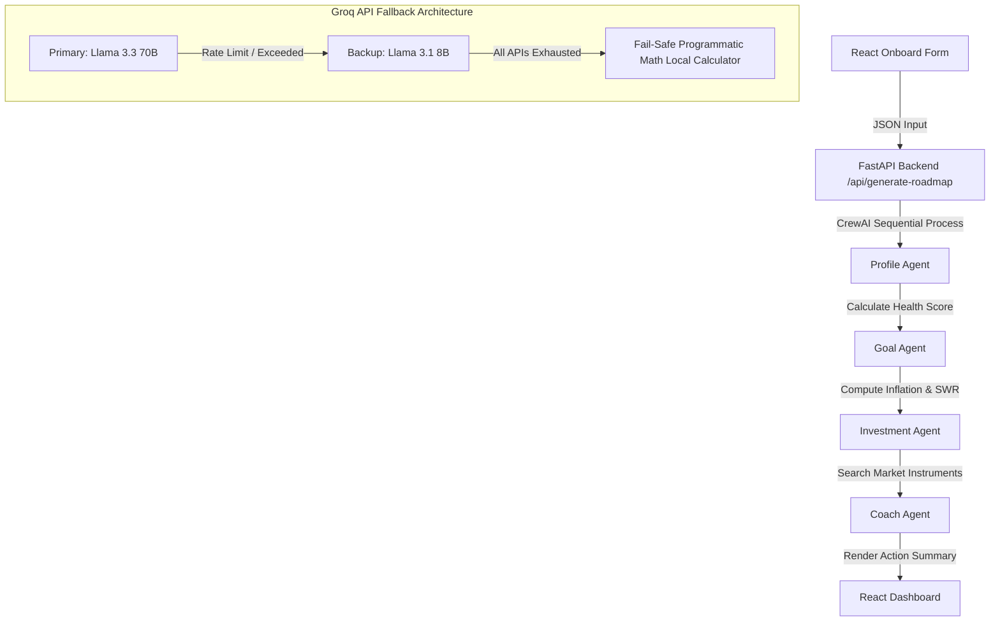

# WealthPath AI 🌿
### *Your Money. Your Retirement. Your Rules.*

WealthPath AI is an intelligent early retirement roadmap planner and interactive personal finance coach. Powered by a collaborative CrewAI multi-agent workflow (Groq Llama 3) and built with React, it analyzes user financial profiles, computes math-based compound growth with annual step-ups, and delivers dynamic, country-specific asset allocations on a premium botanical dashboard.

---

## 🎯 Project Overview
WealthPath AI guides retail earners toward financial independence and early retirement. Users onboard by entering their income, expenses, EMIs, current savings, risk appetite, and goals. The application triggers a multi-agent team that calculates their projected retirement corpus, safe withdrawal limits, and builds a customized systematic investment plan (SIP). The interactive dashboard features:
- **Interactive Step-Up Slider**: Dynamically adjust annual step-up savings rate (1% to 25%) and instantly see changes to final corpus.
- **Split vs. Single Portfolio Toggle**: Side-by-side comparison of a diversified portfolio (including hedges like Gold and Liquid cash) versus a simple 100% equity fund.
- **Maximize Returns Optimization Toggle**: Opt to skip low-return hedges (Gold/Liquid/Index ETFs) and automatically shift allocation to high-growth Mid & Small-caps.
- **AI Coach Chatbox**: Discuss roadmap details, tax implications (ELSS), SWPs, and inflation queries directly with the Llama-powered AI Coach.

---

## ⚠️ Problem Statement
Personal finance remains complex and intimidating for ordinary retail earners due to:
1. **Financial Jargon**: Terminology like SWR (Safe Withdrawal Rate), CAGR, SIP, SWP, and asset class correlation create friction.
2. **Generic Projections**: Simple online calculators assume flat contributions for 30 years and ignore realistic annual salary increases (Step-ups) and inflation decay.
3. **Speculation Risks**: Lack of awareness leads retail investors to dump capital into highly volatile penny stocks, nano-caps, or illiquid land SIPs.
4. **Lack of Hedges**: Portfolios often miss critical defensive shields (emergency liquid cash and gold hedges), forcing investors to liquidate equity holdings during market downturns.

---

## 🛠️ Tech Stack Used

### **Frontend**
- **Core**: React 19 (Vite)
- **Styling**: Tailwind CSS
- **Visualization**: Recharts (Donut Charts & Area Charts)
- **Icons**: Lucide React

### **Backend**
- **Server**: FastAPI (Python), Uvicorn
- **AI Agents**: CrewAI (Sequential Multi-Agent Framework)
- **Model Orchestration**: LiteLLM
- **LLM API Provider**: Groq API
- **Models**:
  - `llama-3.3-70b-versatile` (Primary chat and reasoning)
  - `llama-3.1-8b-instant` (Backup rate-limit fallback)

---

## 🔄 Workflow / Architecture



### **The 4 Cooperating AI Agents**
1. **Profile Agent (The Analyzer)**: CFAs that inspect cash flow, savings rate, and compute a Financial Health Score.
2. **Goal Agent (The Planner)**: Actuarial scientists calculating safe drawdowns and target retirement corpus adjusted for inflation.
3. **Investment Agent (The Researcher)**: Global market experts searching live interest rates and selecting specific mutual funds/ETFs.
4. **Coach Agent (The Advisor)**: Morgan Housel-style coach transforming raw math into jargon-free milestones.

---

## 🚀 Setup Instructions

### **1. Prerequisites**
Ensure you have **Node.js (v18+)** and **Python (3.10+)** installed on your system.

### **2. Setup Environment Variables**
Create a `.env` file in the root directory of the project:
```env
GROQ_API_KEY=your_groq_api_key
SERPER_API_KEY=your_serper_search_api_key
```

### **3. Running the Backend**
```bash
cd backend
python -m venv venv
venv\Scripts\activate      # On Windows
pip install -r requirements.txt
python main.py
```
The backend server runs locally on `http://127.0.0.1:8000`.

### **4. Running the Frontend**
```bash
cd frontend
npm install
npm run dev
```
Open `http://localhost:5173` in your browser to access the app.

---

## 👥 Team Details
- **Team Name**: Error 404
- **Members**:
  - Keerthana M
  - Raksha
  - Hanshika
  - Ananya
- **GitHub Repository**: [ERORR404](https://github.com/keerthanaaids1/ERORR404)
